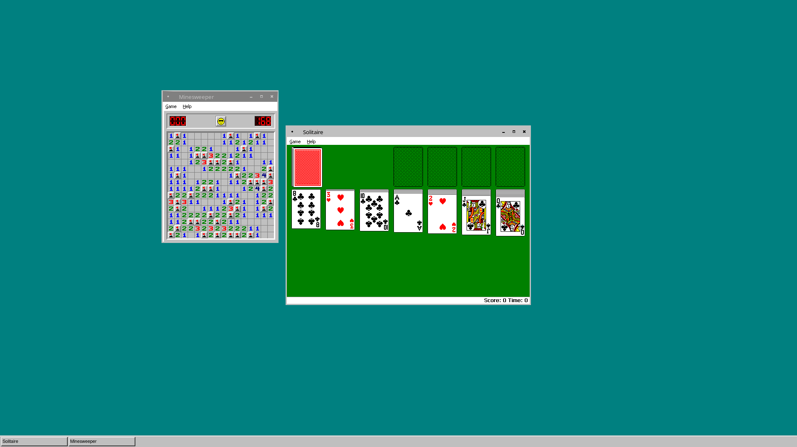

# ilbar

A simple classic taskbar for Wayland desktops.

## Build requirements

- cairo
- GTK+ 3
- meson
- wayland-client
- wayland-protocols
- wayland-scanner
- A C compiler

## Usage requirements

All you need to run ilbar is GTK+ 3 and a Wayland compositor which provides the
following interfaces with at least the following versions:

- wl_compositor, version 4
- wl_seat, version 7
- wl_shm, version 1
- zwlr_foreign_toplevel_manager_v1, version 3
- zwlr_layer_shell_v1, version 4
- zwp_relative_pointer_manager_v1, version 1

You can check if your compositor supports these by using the `wayland-info`
program from within your compositor.

## Screenshot

## License

ilbar is licensed under the MIT License.
